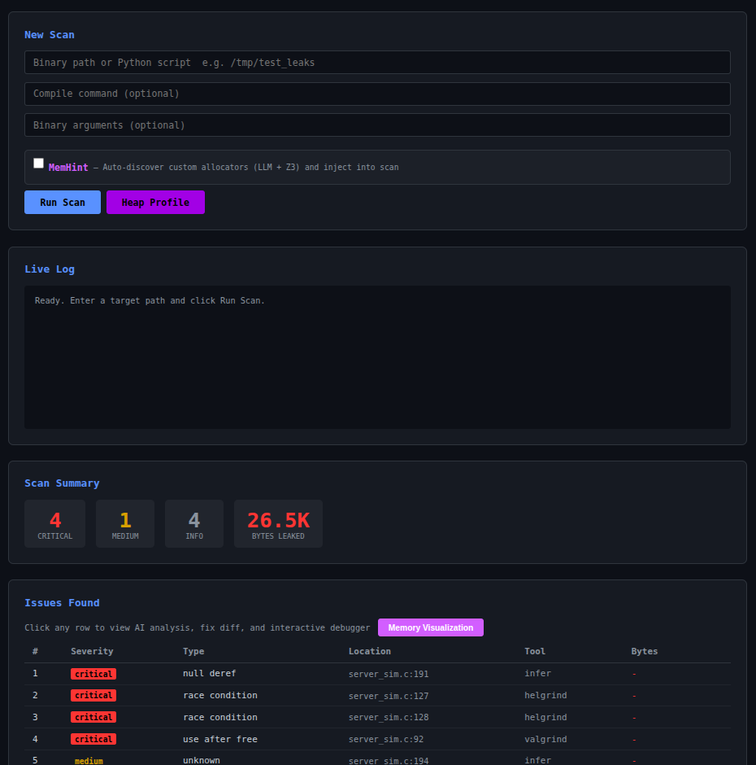
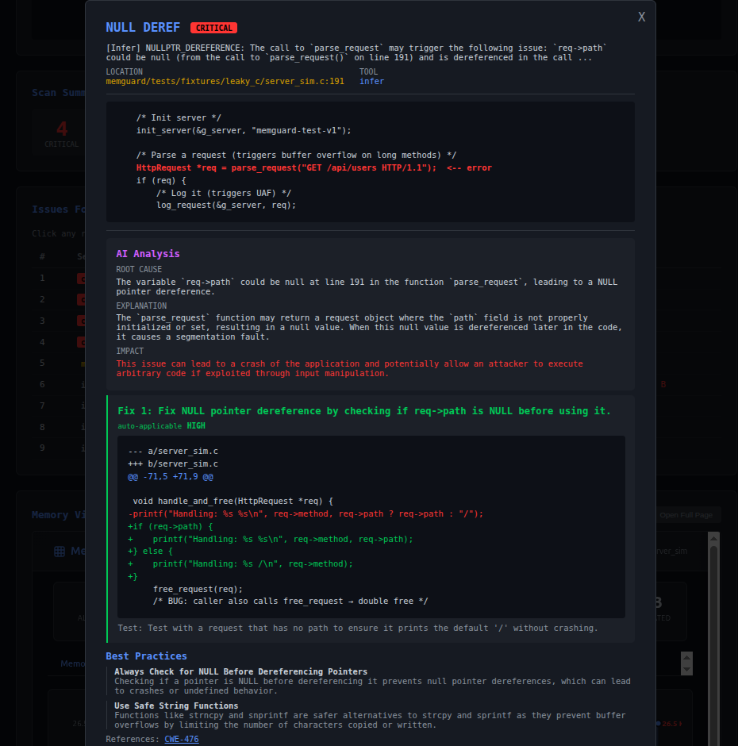
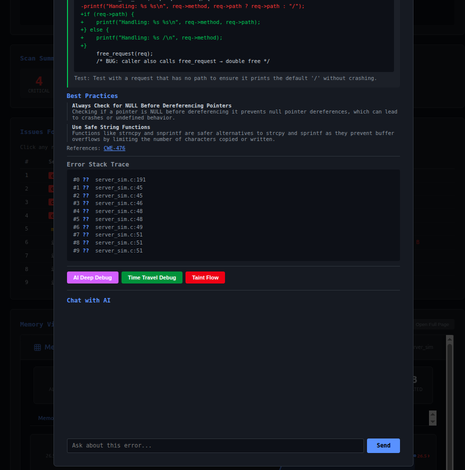

# MemGuard

**Find memory bugs. Understand why. Fix them. Prove it.**

MemGuard is an open-source memory safety platform that brings together 15 detection tools, a local AI analyst, and a time-travel debugger into one workflow. Point it at a binary, and it tells you what's broken, why it's broken, and exactly how to fix it.

No cloud. No telemetry. Everything runs on your machine.

---

## Screenshots

<p align="center">
  
  <br><em>Web dashboard with live scanning, AI analysis, and MemHint integration</em>
</p>

<p align="center">
  
  <br><em>Heap profiling with heaptrack — timeline, top allocators, and flame graph</em>
</p>

<p align="center">
  
  <br><em>AI-powered deep analysis with root cause, code fixes, and CWE references</em>
</p>

---

## What makes it different

Most memory tools do one thing. Valgrind finds leaks. Infer does static analysis. ASan catches overflows. But none of them talk to each other, and none of them tell you *why* a bug exists or *how* to fix it.

MemGuard runs all of them together, deduplicates the results, and sends each bug through an AI analysis pipeline that produces root-cause explanations, code fixes, and CWE references. Then it lets you travel backwards in time through your program's execution to watch the corruption happen in reverse.

The real trick is **MemHint** - a neuro-symbolic pipeline that discovers your project's custom allocators (the ones Infer doesn't know about) by combining an LLM with a Z3 theorem prover. The LLM reads your code and guesses which functions allocate memory. Z3 mathematically verifies whether that's actually true. The validated results get injected into Infer so it can find bugs through your custom wrappers that it would otherwise miss completely.

---

## Quick start

```bash
# Install
git clone https://github.com/memory-analyzer/memguard.git
cd memguard/memguard_release
pip install -e .

# Check your setup
memguard doctor

# Discover custom allocators in your project
memguard memhint ./src/

# Scan a binary
memguard scan /tmp/my_server --tools valgrind,helgrind,infer

# Open the web dashboard
memguard serve
```

---

## What it finds

MemGuard detects **10 categories** of memory bugs:

| Bug | Severity | What goes wrong |
|-----|----------|----------------|
| Use-after-free | Critical | You freed memory but kept using the pointer. Attackers love this one. |
| Double free | Critical | Freeing the same pointer twice corrupts the heap allocator. |
| Buffer overflow | Critical | Writing past the end of a buffer. Classic RCE vector. |
| Null dereference | Critical | Dereferencing NULL. Instant crash. |
| Race condition | Critical | Two threads touching the same memory without locks. |
| Stack overflow | High | Overflowing a stack buffer. |
| Dangling pointer | High | Pointer to memory that's gone out of scope. |
| Invalid free | High | Calling free() on something that wasn't malloc'd. |
| Uninitialized read | Medium | Reading memory before writing to it. |
| Memory leak | Info | Allocated memory that's never freed. Slow death by OOM. |

---

## The tools under the hood

MemGuard orchestrates these tools in parallel and unifies their output:

**Dynamic analysis** - Valgrind memcheck, Helgrind, ASan, LSan, MSan, UBSan, TSan, heaptrack, rr

**Static analysis** - Facebook Infer (with MemHint injection), cppcheck, clang-tidy

**Language-specific** - tracemalloc and memray for Python, Miri for Rust

You don't need all of them installed. MemGuard uses whatever's available and skips the rest.

---

## Features

### MemHint — Neuro-symbolic custom allocator discovery

Your project probably has functions like `create_request()` or `pool_alloc()` that wrap malloc. Static analyzers don't know about them, so they miss every leak through those wrappers.

MemHint fixes this:

1. **tree-sitter** parses your source and extracts every function
2. A **local LLM** classifies each one as allocator, deallocator, or neither
3. **Z3** formally verifies each classification — if there's no feasible path where memory is actually allocated and returned, the summary is rejected

The validated results are automatically injected into Infer's Pulse engine and into the AI analysis prompts.

```bash
memguard memhint ./src/

# Output:
#   Phase 1: 28 extracted → 15 candidates
#   Phase 2: LLM produced 8 summaries
#   Phase 3: Z3 validated 6, rejected 2 (free_request, handle_and_free)
```

Z3 caught that `free_request` doesn't allocate memory — it frees it. Without Z3, Infer would have been told it's an allocator, which would *suppress* real leak warnings.

### AI-powered analysis

Every detected bug passes through four LLM inference passes:

1. **Triage** - confirms the bug type and severity
2. **Deep analysis** - identifies the root cause with line numbers
3. **Fix generation** - produces find/replace code patches
4. **Step decomposition** - breaks the fix into guided steps

Three validators catch bad AI output before you see it: a pattern validator (catches free-then-use), a CWE validator (corrects wrong references), and a JSON escape fixer (handles quirks of smaller models).

When MemHint summaries are available, the AI knows about your custom allocators and generates fixes that use your project's own deallocators instead of raw `free()`.

### Time-travel debugging

Record your program with Mozilla's rr, then replay it backwards with AI guidance:

```bash
memguard record /tmp/my_server
memguard timewarp <scan-id> --launch

# Inside the debugger:
(rr) continue           # run to first bug
(rr) mg-ai              # AI analyzes current state
(rr) reverse-continue   # go backwards in time
(rr) mg-why             # AI explains root cause
(rr) mg-fix             # AI generates the fix
```

Four AI commands (`mg-ai`, `mg-why`, `mg-suggest`, `mg-fix`) call your local LLM from inside GDB, sending it the current backtrace, local variables, source context, and known bugs.

### Taint flow tracker

Answers the question every security engineer asks: *"Can an attacker actually trigger this bug?"*

Traces how external input (`recv`, `fgets`, `scanf`, `argv`, `getenv`) flows through your call graph to each detected bug. Uses variable-level taint propagation with five edge types (parameter passing, return values, struct fields, globals, assignments) and iterative fixpoint analysis.

```bash
memguard taint <scan-id>

# Output:
#   recv() → 'buf' →param parse_request() →return log_request() → USE_AFTER_FREE
#   CRITICAL: Attacker can send crafted packets to trigger this remotely.
#   Confidence: 90%
```

### Heap profiling

Integrates KDE's heaptrack to record every malloc/free with full call stacks:

```bash
memguard heapprofile /tmp/my_server
```

Produces an interactive HTML visualization with heap timeline, top allocators table, and flame graph.

### Binary hardening audit

Checks 8 security mitigations (PIE, Stack Canary, NX, RELRO, FORTIFY_SOURCE, Sanitizer, Debug Info, ASLR) and correlates missing protections with detected bugs to assess exploit feasibility:

```bash
memguard harden /tmp/my_server --scan <scan-id>

# Score: 75/100 (B)
# UAF at :92 → POSSIBLE (missing FORTIFY_SOURCE)
```

### CVE pattern matching

161 CVEs across 14 categories. Each detected bug is matched against known vulnerabilities with similarity scores.

### Memory visualization

Interactive HTML with four tabs: memory profile chart, allocation table with detail drawer, heap treemap, and ownership flow graph.

### Web dashboard

```bash
memguard serve   # http://127.0.0.1:7331
```

Real-time WebSocket scanning, clickable issues with inline AI analysis, MemHint checkbox with auto-detect, heap profiling button, taint flow panel, time-travel debug panel, and scan history.

---

## Installation

**Requirements:** Linux , Python 3.10+, 8 GB RAM

```bash
# Core tools
sudo apt install valgrind gcc gdb cppcheck clang-tidy heaptrack

# Facebook Infer
curl -sSL "https://github.com/facebook/infer/releases/download/v1.2.0/infer-linux-x86_64-v1.2.0.tar.xz" \
  | sudo tar -C /opt -xJ
sudo ln -sf /opt/infer-linux-x86_64-v1.2.0/bin/infer /usr/local/bin/infer

# AI backend (runs locally, no cloud)
curl -fsSL https://ollama.com/install.sh | sh
ollama pull qwen2.5-coder:14b-instruct-q4_K_M

# Neuro-symbolic dependencies
pip install z3-solver tree-sitter tree-sitter-c

# MemGuard itself
git clone https://github.com/memory-analyzer/memguard.git
cd memguard/memguard_release
pip install -e .

# Verify
memguard doctor
```

For time-travel debugging, build rr from source (needed for recent Intel CPUs):

```bash
cd /tmp && git clone https://github.com/rr-debugger/rr.git
cd rr && mkdir build && cd build
cmake -G Ninja .. -DCMAKE_BUILD_TYPE=Release -Ddisable32bit=ON
ninja -j$(nproc) && sudo ninja install
sudo sysctl kernel.perf_event_paranoid=1
```

---

## CLI reference

```
memguard scan <binary>           Scan with all tools + AI analysis
memguard memhint <source_dir>    Discover custom allocators (LLM + Z3)
memguard serve                   Web dashboard on :7331
memguard viz <scan-id>           Memory visualization
memguard explain <id> --issue N  AI reasoning chain
memguard taint <scan-id>         Taint flow analysis
memguard harden <binary>         Binary security audit
memguard heapprofile <binary>    Heap profiling (heaptrack)
memguard record <binary>         Record for time-travel
memguard timewarp <id> --launch  AI reverse debugger
memguard cves <scan-id>          CVE pattern matching
memguard diff <id-a> <id-b>      Regression detection
memguard suppress <id>           Generate Valgrind .supp
memguard doctor                  Check tool availability
memguard history                 List past scans
```

---

## Architecture

```
Source/Binary
     │
     ├── MemHint: tree-sitter → LLM → Z3 → summaries.json
     │
     ├── Runner: Valgrind │ Helgrind │ Infer(+MemHint) │ cppcheck
     │
     ├── Parsers: XML/JSON → unified MemoryError objects
     │
     ├── AI Analyzer: Triage → Deep → Fix → Steps (+MemHint context)
     │
     ├── Validators: Fix Validator │ CWE Validator │ Z3 Verifier
     │
     ├── Taint Flow: Source discovery → Call graph → Variable-level propagation
     │
     ├── Security: CVE matching │ Hardening audit │ Exploit assessment
     │
     └── Presentation: CLI (Rich) │ Web (FastAPI+WebSocket) │ HTML Viz
```

---

## Documentation

Full documentation is in the `https://memory-analyzer.github.io`

---

## License

MIT License - see [LICENSE](LICENSE) for details.

---

*MemGuard doesn't just find bugs - it explains them, fixes them, and proves the fix works.*
